# Failure Taxonomy (`failure-analysis-v1`)

This document defines the standardized, peer-level classification hierarchy for `case-failure-analyzer`. Every `analysis.json` assigns a `failure_stage`, a `detection_stage`, and a `primary_root_cause` (`category`, `subtype`, `code`).

---

## 1. Execution & Detection Stages

| Stage ID | Description |
|---|---|
| `environment_build` | Docker image pull, `Dockerfile` build, or `docker compose build` before container start |
| `environment_runtime` | Container startup, volume mounting, or runtime daemon execution |
| `agent_setup` | Installing/initializing the agent binary (`claude-code`, MCP, env vars) inside the container |
| `agent_execution` | Agent reasoning, tool calls, scientific simulation execution, and result generation |
| `verifier_execution` | Execution of `tests/test.sh` and `tests/verify.py` |
| `runner` | Host benchmark runner (`harbor`) orchestration and lifecycle management |

---

## 2. Four Peer-Level Root Cause Categories (统一同层级四大根因分类体系)

Failure attribution is structured into four mutually exclusive, peer-level systemic categories, each representing an independent source of failure in scientific benchmark evaluations.

```mermaid
flowchart TD
    Root["Benchmark Failure Attribution\n基准评测系统级因果归因"]
    
    Root --> C1["1. 智能体决策与执行失误\n(agent)"]
    Root --> C2["2. 基准题目与规格设计缺陷\n(case)"]
    Root --> C3["3. 运行环境与依赖设施缺陷\n(infra)"]
    Root --> C4["4. 评测验证与规则判定缺陷\n(verifier)"]

    C1 --> C11["科学方法选型 (scientific_method_selection)"]
    C1 --> C12["科学参数设定 (scientific_parameter_selection)"]
    C1 --> C13["任务与契约理解 (task_understanding)"]
    C1 --> C14["工作流规划 (planning)"]
    C1 --> C15["代码与工具调用 (tool_use)"]
    C1 --> C16["结果校验归一化 (result_validation)"]

    C2 --> C21["题干约定缺失/歧义 (ambiguous_contract)"]
    C2 --> C22["初始资产缺失/损坏 (missing/corrupt_asset)"]
    C2 --> C23["参考真值矛盾 (prompt_ref_mismatch)"]
    C2 --> C24["算力与耗时预算不足 (insufficient_timeout)"]

    C3 --> C31["容器镜像与运行时崩溃 (container_build/runtime)"]
    C3 --> C32["外部网络通信异常 (external_network)"]
    C3 --> C33["LLM API 网关与限流 (api_error/api_rate_limit)"]
    C3 --> C34["资源耗尽与生命周期中断 (oom/disk/runner_lifecycle)"]

    C4 --> C41["验证器超紧容差碰撞 (tolerance_too_strict)"]
    C4 --> C42["验证器强类型不兼容 (schema_mismatch)"]
    C4 --> C43["正则与文本解析缺陷 (regex_or_parser_defect)"]
    C4 --> C44["隐藏未声明私有契约 (hidden_contract)"]
    C4 --> C45["验证器自身脚本崩溃 (recompute_defect)"]
```

---

### 2.1 智能体决策与执行失误 (`agent`)
**责任主体**：被评测的大模型智能体。当题目规格、运行环境与验证器均正常时，智能体发生未自愈的科学决策、工程规划或代码编写错误。

| Code | Subtype | 中文子类名称 | 详细说明与典型表现 |
|---|---|---|---|
| `AGENT_SCIENTIFIC_METHOD_SELECTION` | `scientific_method_selection` | 科学方法与理论模型选型失误 | 理论模型、泛函基组、力场、系综或自洽场求解器选型错误（如未识别自由基为开壳层，未开启自旋极化 LSD/UKS） |
| `AGENT_SCIENTIFIC_PARAMETER_SELECTION` | `scientific_parameter_selection` | 科学参数与收敛截断配置失误 | 积分时间步长超出稳定性上限（如 LJ 流体步长 > 0.006）、微分步长过大、k点网格移位偏差、截断能未收敛 |
| `AGENT_TASK_UNDERSTANDING` | `task_understanding` | 任务契约与物理量定义理解偏差 | 对题干物理量概念或数学范数理解偏差（如混淆受力分量极值 L_inf 与原子合力向量模长 L2）、拟合区间对齐错误 |
| `AGENT_PLANNING` | `planning` | 工作流编排与上下文状态保持失误 | 多阶段计算次序错乱、未冻结前序构型资产（误触发弛豫）、未正确关联前序输出目录（`outdir`/`prefix`） |
| `AGENT_TOOL_USE` | `tool_use` | 工具调用与脚本生成缺陷 | 自动化生成输入文件或解析脚本时出现语法错误、遗漏关键晶胞参数（如 `celldm(1)`）或写错文件 |
| `AGENT_RESULT_VALIDATION` | `result_validation` | 结果后处理与数据核验失误 | 量纲单位转换除错、每原子归一化因子除错、衍生量未核验物理自洽性即写入 `results.json` |
| `AGENT_PATH_OR_DEPENDENCY_DISCOVERY` | `path_or_dependency_discovery` | 环境依赖与资产寻址失败 | 未能在容器已知路径中定位已预装的二进制、赝势文件、力场参数文件或 Checkpoint |
| `AGENT_ERROR_DIAGNOSIS` | `error_diagnosis` | 物理报错诊断失误 | 仿真软件已给出明确报错诊断，智能体误判物理诱因并进行无效修改 |
| `AGENT_RECOVERY` | `recovery` | 自愈恢复策略失效 | 面对错误盲目重复执行完全相同的失败命令，或陷入重试死循环 |
| `AGENT_PREMATURE_TERMINATION` | `premature_termination` | 任务过早终止 | 在关键模拟未收敛或产物未交付前主动停止规划 |

---

### 2.2 基准题目与规格设计缺陷 (`case`)
**责任主体**：基准出题人与指令规范。评测题目的 prompt 说明、先验假设、初始资产或参考真值本身存在不完备、歧义或物理冲突。

| Code | Subtype | 中文子类名称 | 详细说明与典型表现 |
|---|---|---|---|
| `CASE_AMBIGUOUS_CONTRACT` | `ambiguous_contract` | 题干约定缺失或语义歧义 | 题干未指明双向符号约定（如漂移率正负号定义）、未指明生产相采样步数、未在 Fixed Conditions 中固化仿真微调参数（如 neighbor_modify 导致重启发散）、算法严格/宽松定义分歧（如 RDKit 可旋转键数计算） |
| `CASE_MISSING_ASSET` | `missing_asset` | 初始资产文件缺失 | 题干引用的输入结构、赝势或参数文件在容器中实际不存在 |
| `CASE_CORRUPT_ASSET` | `corrupt_asset` | 初始物料数据损坏 | 提供的输入结构存在非物理重叠或格式损坏，且非题目故意考察的排障点 |
| `CASE_PROMPT_REF_MISMATCH` | `prompt_ref_mismatch` | 参考真值与题干要求矛盾 | `refs.json` 中标定的真值采用的计算方法或参数与题干要求的条件不一致 |
| `CASE_INSUFFICIENT_TIMEOUT` | `insufficient_timeout` | 超时预算或算力配额不合理 | 任务所需科学计算量在标准 CPU 配额下理论无法在限时内完成 |

---

### 2.3 运行环境与依赖设施缺陷 (`infra`)
**责任主体**：底层运行平台与执行基础设施。与题目逻辑及判分代码独立，属于软硬件支撑层。

| Code | Subtype | 中文子类名称 | 详细说明与典型表现 |
|---|---|---|---|
| `INFRA_CONTAINER_BUILD` | `container_build` | 容器镜像构建失败 | Docker 镜像拉取或 `Dockerfile` 构建命令执行失败 |
| `INFRA_CONTAINER_RUNTIME` | `container_runtime` | 容器运行时异常 | 容器意外崩溃、后台守护进程挂死或挂载失效 |
| `INFRA_EXTERNAL_NETWORK` | `external_network` | 外部网络通信异常 | 构建或初始化阶段 `apt`、`pip`、外部模型拉取因网络阻断失败 |
| `INFRA_API_ERROR` | `api_error` | LLM API 网关异常 | LLM Gateway 代理返回 HTTP 5xx/502/504 或连接重置 |
| `INFRA_API_RATE_LIMIT` | `api_rate_limit` | API 配额限流 | 触发大模型 API 请求频次限制 (HTTP 429) |
| `INFRA_OOM` | `oom` | 内存溢出 | 容器或计算进程触发 OOM Killer (`SIGKILL` / exit 137) |
| `INFRA_DISK` | `disk` | 磁盘空间耗尽 | 容器存储配额耗尽 (`No space left on device`) |
| `INFRA_AGENT_TIMEOUT` | `agent_timeout` | 智能体执行超时 | 智能体推理与工具交互超出总时限门禁 |
| `INFRA_RUNNER_LIFECYCLE` | `runner_lifecycle` | 评测宿主调度异常 | 评测框架调度死锁、强制取消或 Runner 宿主崩溃 |

---

### 2.4 评测验证与规则判定缺陷 (`verifier`)
**责任主体**：评测验证脚本（`verify.py`、`test.sh`）与考核规则。Agent 的计算或产物在物理/化学目标上完全正确，但被判分脚本错误拒绝。

| Code | Subtype | 中文子类名称 | 详细说明与典型表现 |
|---|---|---|---|
| `VERIFIER_TOLERANCE_TOO_STRICT` | `tolerance_too_strict` | 验证器容差过于苛刻 | 能量/受力容差远小于数值/物理平台噪声或化学有效精度（如微电子伏级 1 µeV 超紧容差碰撞），导致物理正确但判定为 0 |
| `VERIFIER_SCHEMA_MISMATCH` | `schema_mismatch` | 验证器强类型比较不兼容 | 验证器执行脆弱的强类型断言比对（如硬编码 `isinstance(..., int)` 拒绝字符串整数 `"100"`，`"12"`），未做宽容类型转换 |
| `VERIFIER_REGEX_OR_PARSER_DEFECT` | `regex_or_parser_defect` | 验证器文本解析与正则缺陷 | 验证器正则未过滤 LAMMPS run 0 打印的重复表头、无法解析科学记数法（如 Fortran `D+03`）或多行输出 |
| `VERIFIER_HIDDEN_CONTRACT` | `hidden_contract` | 验证器隐藏未公开私有契约 | 验证器校验了题干从未声明的内部中间文件、特定列顺序或非标私有字段 |
| `VERIFIER_RECOMPUTE_DEFECT` | `recompute_defect` | 验证器自身重算崩溃 | 验证器独立重算脚本因自身临时目录配置缺失、路径未转义或缺失环境依赖而抛出异常崩溃 |

---

### 2.5 辅助类别：未知与证据缺失 (`unknown`)
仅当运行产物严重缺失，无法建立确定性因果链时使用。

| Code | Subtype | 中文说明 |
|---|---|---|
| `UNKNOWN_INSUFFICIENT_EVIDENCE` | `insufficient_evidence` | 关键日志缺失、无执行轨迹，或竞争假设证据置信度无法区分 |
